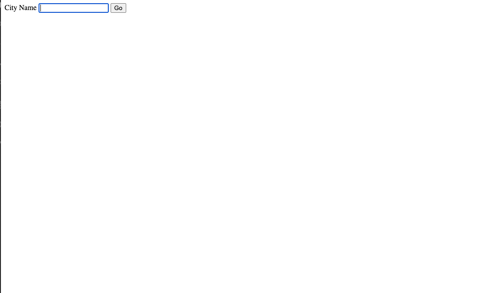
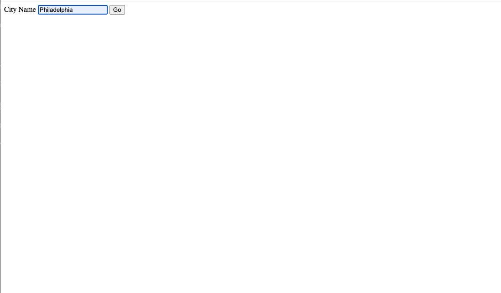
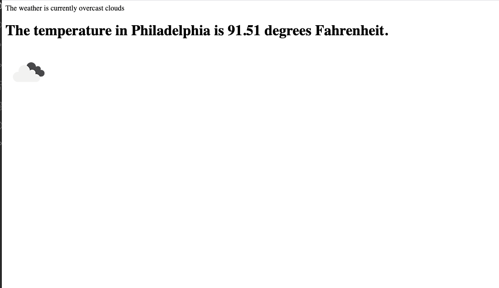

# Weather-project

 ## Application description:

An express backend application that fetches a weather  API to the user. The API will display the current tempuerture in the searched city and display  images based on the current condiions such as sunny, cloudy, rainy, ect.  
 

 ## Click [here]( https://drive.google.com/file/d/1erUFYWiqZ8gcBxr5unZPOyNhIvJe1Ui1/view?usp=sharing) to view a video for the app. 
 
 This is the start screen:
 
 
 
 The city is then typed in the input box:
 
 
 
  The citys tempuerature  is then displayed with images showing the current conditions:
 
  
 This is a recorded example of the game:
 

  
  

     
## Libraries and Frameworks:
- Javascript
- Node
- Express
- Open Weather API

## Email:

bml201095@gmail.com
